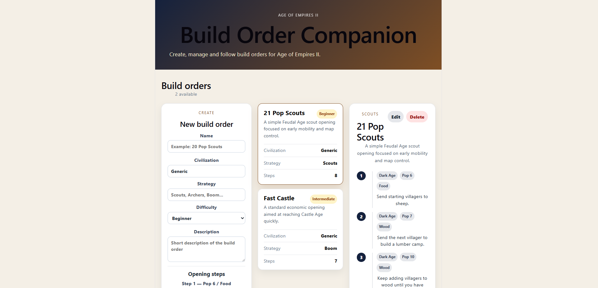

# AoE2 Build Order Companion

A small full-stack web application for creating, managing and following Age of Empires II build orders.

The project is built as a practical portfolio project using a .NET backend, a React frontend and SQL Server persistence.

## Screenshot



## What this project demonstrates

- Building a full-stack application with ASP.NET Core and React
- Designing REST API endpoints for CRUD operations
- Persisting relational data with Entity Framework Core and SQL Server
- Using EF Core migrations and seed data
- Writing automated integration tests for API endpoints
- Running backend tests and frontend builds in GitHub Actions CI

## Tech stack

- ASP.NET Core Web API
- C# / .NET
- Entity Framework Core
- SQL Server LocalDB
- React
- TypeScript
- Vite
- REST API

## Current features

- View a list of Age of Empires II build orders
- View detailed build order steps
- Create new build orders from the React client
- Edit existing build orders
- Delete build orders
- Store build orders and steps in SQL Server using Entity Framework Core
- Seed initial build order data on first run
- Run automated API integration tests
- Run CI checks with GitHub Actions

## Architecture

The application is split into three main parts:

- `client/` — React and TypeScript frontend built with Vite
- `src/Aoe2BuildOrders.Api/` — ASP.NET Core Web API
- `tests/Aoe2BuildOrders.Tests/` — API integration tests

The React client communicates with the API through REST endpoints. The API uses Entity Framework Core to persist build orders and build order steps in SQL Server LocalDB during local development.

## Local development setup

### Prerequisites

- .NET SDK
- Node.js
- SQL Server LocalDB
- Entity Framework Core CLI

Run the API:
```bash
dotnet run --project src/Aoe2BuildOrders.Api
```

The API runs at:
```bash
http://localhost:5198
```

Swagger is available at:
```bash
http://localhost:5198/swagger
```

Run the React client:
```bash
cd client
npm install
npm run dev
```

The React client runs at:
```bash
http://localhost:5173
```

## Database

The API uses Entity Framework Core with SQL Server LocalDB for local persistence.

On startup, the API applies pending EF Core migrations and seeds the database with initial build orders if the database is empty.

The local connection string is configured in:
```bash
src/Aoe2BuildOrders.Api/appsettings.json
```

To reset the local database:
```bash
dotnet ef database drop --project src/Aoe2BuildOrders.Api
dotnet run --project src/Aoe2BuildOrders.Api
```

## Roadmap

- Add dynamic create/edit form steps
- Add filtering or search for build orders
- Deploy API and database to Azure
- Add Azure infrastructure with Bicep
